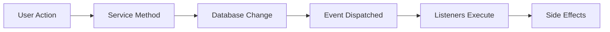

# Event System

Leverage the event-driven architecture to react to ticket lifecycle changes.

## Event Flow



## Listening to Events

### Using Event Service Provider

```php
// app/Providers/EventServiceProvider.php
use LucaLongo\LaravelHelpdesk\Events\*;
use App\Listeners\*;

class EventServiceProvider extends ServiceProvider
{
    protected $listen = [
        TicketCreated::class => [
            SendNewTicketNotification::class,
            AssignToAvailableAgent::class,
            CheckForDuplicates::class,
        ],
        
        TicketStatusChanged::class => [
            LogStatusChange::class,
            NotifyStatusSubscribers::class,
            UpdateSlaMetrics::class,
        ],
        
        SlaBreach::class => [
            EscalateTicket::class,
            NotifyManagement::class,
            CreateIncidentReport::class,
        ],
    ];
}
```

### Creating Listeners

```php
namespace App\Listeners;

use LucaLongo\LaravelHelpdesk\Events\TicketCreated;
use App\Mail\NewTicketMail;
use Illuminate\Support\Facades\Mail;

class SendNewTicketNotification
{
    public function handle(TicketCreated $event): void
    {
        $ticket = $event->ticket;
        
        // Send to customer
        if ($ticket->customer_email) {
            Mail::to($ticket->customer_email)
                ->send(new NewTicketMail($ticket));
        }
        
        // Send to team
        Mail::to('support@example.com')
            ->send(new NewTicketAlertMail($ticket));
    }
}
```

### Using Subscribers

```php
namespace App\Listeners;

use LucaLongo\LaravelHelpdesk\Events\*;

class TicketEventSubscriber
{
    public function handleCreated(TicketCreated $event): void
    {
        $this->logActivity('Ticket created', $event->ticket);
    }
    
    public function handleStatusChanged(TicketStatusChanged $event): void
    {
        $this->logActivity(
            "Status changed from {$event->previous->label()} to {$event->next->label()}",
            $event->ticket
        );
    }
    
    public function handleAssigned(TicketAssigned $event): void
    {
        if ($event->assignee) {
            $this->notifyAssignee($event->ticket, $event->assignee);
        }
    }
    
    public function subscribe(Dispatcher $events): array
    {
        return [
            TicketCreated::class => 'handleCreated',
            TicketStatusChanged::class => 'handleStatusChanged',
            TicketAssigned::class => 'handleAssigned',
        ];
    }
    
    private function logActivity(string $description, $ticket): void
    {
        activity()
            ->performedOn($ticket)
            ->causedBy(auth()->user())
            ->withProperties(['ip' => request()->ip()])
            ->log($description);
    }
}
```

## Queueable Listeners

```php
use Illuminate\Contracts\Queue\ShouldQueue;
use Illuminate\Queue\InteractsWithQueue;

class ProcessTicketWithAI implements ShouldQueue
{
    use InteractsWithQueue;
    
    public $queue = 'ai-processing';
    public $delay = 5; // seconds
    public $tries = 3;
    
    public function handle(TicketCreated $event): void
    {
        $ticket = $event->ticket;
        
        // Heavy AI processing
        $analysis = app(AIService::class)->analyze($ticket);
        
        if (!$analysis) {
            $this->release(60); // Retry after 1 minute
            return;
        }
        
        // Process results
        $this->processAnalysis($ticket, $analysis);
    }
    
    public function failed(TicketCreated $event, Throwable $exception): void
    {
        Log::error('AI processing failed', [
            'ticket_id' => $event->ticket->id,
            'error' => $exception->getMessage(),
        ]);
    }
}
```

## Custom Events

### Creating Custom Events

```php
namespace App\Events;

use Illuminate\Broadcasting\InteractsWithSockets;
use Illuminate\Foundation\Events\Dispatchable;
use Illuminate\Queue\SerializesModels;
use LucaLongo\LaravelHelpdesk\Models\Ticket;

class TicketEscalatedToManager
{
    use Dispatchable, InteractsWithSockets, SerializesModels;
    
    public function __construct(
        public Ticket $ticket,
        public User $manager,
        public string $reason
    ) {}
    
    public function broadcastOn(): array
    {
        return [
            new PrivateChannel('managers'),
            new PrivateChannel('ticket.'.$this->ticket->id),
        ];
    }
    
    public function broadcastAs(): string
    {
        return 'ticket.escalated';
    }
    
    public function broadcastWith(): array
    {
        return [
            'ticket_id' => $this->ticket->id,
            'manager_id' => $this->manager->id,
            'reason' => $this->reason,
            'priority' => $this->ticket->priority->value,
        ];
    }
}
```

### Dispatching Custom Events

```php
use App\Events\TicketEscalatedToManager;

// In your service or controller
$manager = User::role('manager')->first();

event(new TicketEscalatedToManager(
    $ticket,
    $manager,
    'SLA breach on urgent ticket'
));

// Or with helper
TicketEscalatedToManager::dispatch($ticket, $manager, 'SLA breach');
```

## Event Testing

```php
use Illuminate\Support\Facades\Event;
use LucaLongo\LaravelHelpdesk\Events\TicketCreated;

test('creating ticket dispatches event', function () {
    Event::fake();
    
    $ticket = LaravelHelpdesk::open([
        'subject' => 'Test',
        'type' => 'support',
    ]);
    
    Event::assertDispatched(TicketCreated::class, function ($event) use ($ticket) {
        return $event->ticket->id === $ticket->id;
    });
    
    Event::assertDispatchedTimes(TicketCreated::class, 1);
});

test('listener processes event correctly', function () {
    Event::fake([TicketCreated::class]);
    
    $listener = new SendNewTicketNotification();
    $ticket = Ticket::factory()->create();
    $event = new TicketCreated($ticket);
    
    Mail::fake();
    
    $listener->handle($event);
    
    Mail::assertSent(NewTicketMail::class, function ($mail) use ($ticket) {
        return $mail->ticket->id === $ticket->id;
    });
});
```

## Real-time Updates

### Broadcasting Events

```php
class TicketUpdated implements ShouldBroadcast
{
    use Dispatchable, InteractsWithSockets, SerializesModels;
    
    public function __construct(
        public Ticket $ticket
    ) {}
    
    public function broadcastOn(): Channel
    {
        return new PresenceChannel('ticket.'.$this->ticket->id);
    }
    
    public function broadcastWith(): array
    {
        return [
            'ticket' => $this->ticket->only(['id', 'status', 'priority', 'updated_at']),
            'user' => auth()->user()?->name,
        ];
    }
}
```

### Frontend Integration

```javascript
// Listen for real-time updates
Echo.join(`ticket.${ticketId}`)
    .listen('.ticket.updated', (e) => {
        console.log('Ticket updated:', e.ticket);
        updateUI(e.ticket);
    })
    .listen('.ticket.escalated', (e) => {
        showNotification('Ticket has been escalated!');
    });
```

## Event Middleware

```php
class LoggableEventMiddleware
{
    public function handle($event, $next)
    {
        Log::debug('Event dispatched: '.get_class($event));
        
        $result = $next($event);
        
        Log::debug('Event processed: '.get_class($event));
        
        return $result;
    }
}

// Register in EventServiceProvider
public function boot()
{
    Event::listen('*', LoggableEventMiddleware::class);
}
```